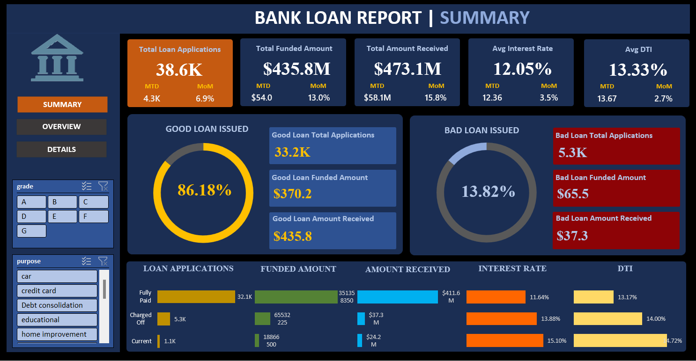
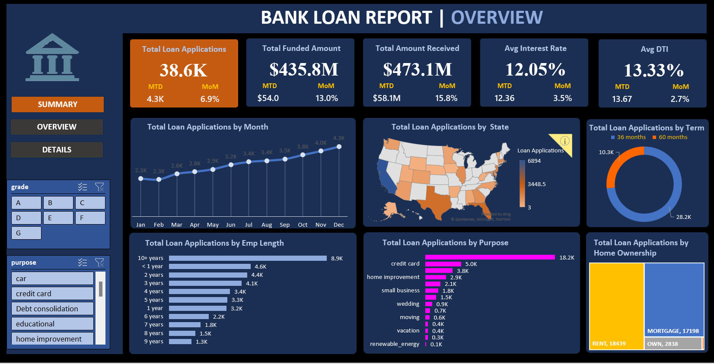

# Bank-Loan-Project-Excel
This project demonstrates the end-to-end process of designing a comprehensive data analyst portfolio project. The primary objective is to analyze and visualize bank loan data, addressing a defined problem statement. The project covers various aspects, including data cleaning, transformation, and visualization within Microsoft Excel.

## Summary Page

## Overview Page

